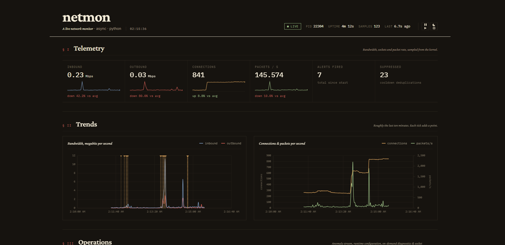
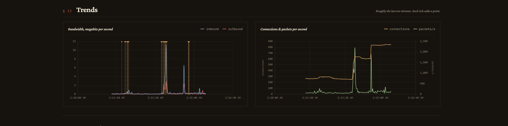
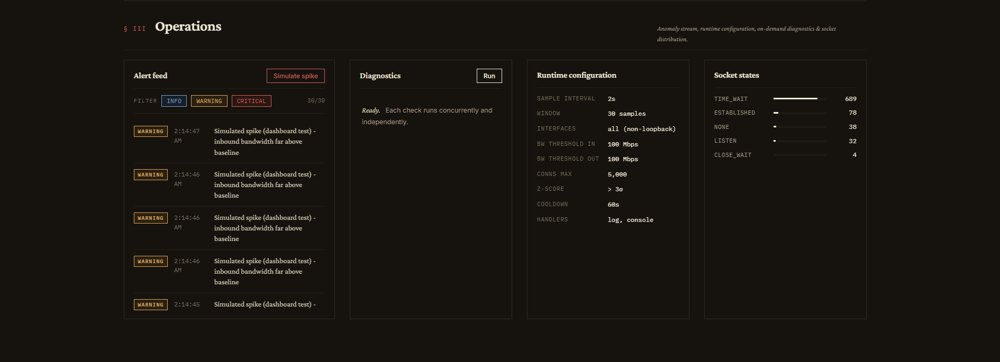

# netmon — Network Monitoring & Automation Tool

An async, single-host network monitor and automation tool built on `psutil` and
`asyncio`. It samples bandwidth, packet, and connection statistics on a tight
interval, detects anomalies (hard thresholds + statistical spike detection),
and dispatches alerts to pluggable handlers (log, console, external script,
webhook).

```
+-----------+     samples     +----------+   anomalies   +----------+
|  Monitor  | --------------> | Analyzer | ------------> |  Alerts  |
| (psutil)  |                 |  (z + θ) |               | (multi)  |
+-----------+                 +----------+               +----------+
      |                            |                          |
      |       +----------------+   |    +-----------------+   |
      +-----> |  StateStore    | <-+----+  Handlers (cb)  | <-+
              | (.json snap.)  |        |  log/console/   |
              +----------------+        |  script/webhook |
                     ^                  +-----------------+
                     |
              show-status (CLI reads snapshot)
```

## Quickstart

```bash
pip install -r requirements.txt

# Foreground monitor (Ctrl+C to stop). Reads ./config.yaml by default.
python -m netmon start-monitor

# Same, plus the live web dashboard at http://127.0.0.1:8765
python -m netmon start-monitor --dashboard --open

# In another terminal:
python -m netmon show-status              # one-shot
python -m netmon show-status --watch 2    # refresh every 2s
python -m netmon show-status --json       # machine-readable

# One-shot diagnostics (DNS, ping, interfaces, listening sockets, top talkers):
python -m netmon run-diagnostics
python -m netmon run-diagnostics --json
```

## Dashboard

A presentation-ready web UI is bundled. Launch it alongside the monitor:

```bash
python -m netmon start-monitor --dashboard --port 8765 --open
```

What you get:

- **KPI strip** — live Mbps in/out, connection count, packets/s, alerts fired/suppressed
- **Bandwidth chart** — last ~10 min, area-filled, in/out overlay
- **Connections + packets/s chart** — dual y-axis line chart
- **Alert feed** — newest first, severity-coloured, flashes on arrival
- **Diagnostics panel** — one-click run; results inline
- **Configuration panel** — current thresholds, cooldown, handlers
- **Connection-state panel** — ESTABLISHED / LISTEN / TIME_WAIT counts
- **Simulate Spike button** — injects a synthetic anomaly through the *real*
  pipeline. Useful for live demos: shows the alert lighting up, the feed
  updating, and the cooldown kicking in if you mash the button.

The dashboard is one process: aiohttp serves the static page and a WebSocket
that pushes one event per tick. Multiple browser tabs/clients can attach;
each gets its own bounded queue. Slow consumers are dropped, never blocked
on, so the monitor loop is unaffected. If the WS drops, the client
auto-reconnects every 1.5 s.

Endpoints (use them directly for scripting / scraping):

| method | path | returns |
|---|---|---|
| GET  | `/`                   | dashboard SPA |
| GET  | `/api/status`         | full snapshot (latest sample, alert stats, recent anomalies) |
| GET  | `/api/history`        | ring buffer of recent sample summaries (for charts) |
| GET  | `/api/alerts`         | recent anomalies |
| GET  | `/api/config`         | thresholds, interval, handler list (read-only) |
| POST | `/api/diagnostics`    | runs the diagnostics suite, returns JSON |
| POST | `/api/simulate`       | injects a synthetic anomaly into the next tick |
| WS   | `/ws`                 | live event stream: `{type: hello}`, then `{type: tick}` per sample |

## Project layout

```
netmon/
  __main__.py     # `python -m netmon` entry
  cli.py          # argparse-based subcommands
  config.py       # YAML -> dataclasses
  logger.py       # rotating file + optional console
  monitor.py      # NetworkMonitor — psutil sampling + counter deltas
  analyzer.py     # Analyzer — thresholds + rolling-window z-score
  alerts.py       # AlertManager — handlers, cooldown, concurrent dispatch
  diagnostics.py  # one-shot system checks
  state.py        # StateStore — atomic JSON snapshot + history ring
  hub.py          # Pub/sub for live dashboard subscribers
  runner.py       # Runner — the asyncio loop tying it all together
  dashboard/
    server.py     # aiohttp REST + WebSocket
    static/
      index.html  # single-page UI
      style.css   # dark theme
      app.js      # WS client + Chart.js renderers
config.yaml       # defaults; copy and edit
examples/
  alert_action.py # external script handler example
```

## Design decisions

**Async, single loop.** `psutil` exposes counters, not events, so we poll. A
short interval (1–5 s) is the standard pattern. The loop is one coroutine —
no thread pool, no message queue. Handlers run concurrently inside `asyncio`,
and any `psutil` call that could block the event loop (`net_connections` on
Windows in particular) is offloaded with `asyncio.to_thread`.

**Drift-resistant timing.** Each tick computes its own duration and sleeps
for the *remainder* of the interval, so a slow tick doesn't push subsequent
ticks late. Stop is signalled via an `asyncio.Event`; the sleep wakes up
immediately on shutdown rather than waiting out the interval.

**Cumulative counter handling.** `psutil.net_io_counters` returns
since-boot byte/packet totals. We diff against the previous sample and
divide by elapsed wall-clock time to get rates. A negative delta (NIC
reset, counter rollover) is clamped to zero so we don't emit a phantom
multi-gigabit spike.

**Two-layer anomaly detection.**
1. *Hard thresholds* — fast, deterministic, owner-defined.
2. *Z-score over a rolling window* — flags values more than `N` stdevs above
   the rolling mean. Useful for "unusual for *this* host" patterns that no
   static threshold would catch.

The z-score compares the current value against the *prior* window so the
spike doesn't inflate its own baseline. We skip the check until
`min_samples_for_stats` are collected to avoid jumpy stats while the window
fills, and we only alert on upward deviations.

**State as an atomic JSON file.** Cross-process status reads use a snapshot
file written via `tempfile + os.replace`, which is atomic on POSIX and
Windows (same volume). No socket, no port, no second daemon — a partial
read is impossible. `show-status` is just a JSON reader. For multi-host
deployments, replace this with Prometheus/InfluxDB.

**Cooldown per anomaly key.** A sustained condition would otherwise spam.
The cooldown is keyed on the anomaly *type* (`threshold:mbps_in`,
`zscore:conns`, ...), so a different anomaly fires immediately while a
recurring one is suppressed.

**Handlers can fail without taking down the loop.** Every handler is wrapped
so a misbehaving webhook or script logs an exception and the next tick
proceeds. Dispatch is `gather(..., return_exceptions=True)`.

## Anomaly detection — example

Open the box and trace a spike:

1. The monitor takes a sample every `interval_seconds`. Sample N has
   `mbps_in = 4.2` Mbps; the prior 30 samples averaged 0.3 Mbps with a stdev
   of 0.1 Mbps.
2. The analyzer evaluates:
   - Hard threshold (`bandwidth_mbps_in: 100`)? `4.2 < 100` → no fire.
   - Z-score: `(4.2 - 0.3) / 0.1 = 39` → way above `zscore_threshold: 3.0`
     → `Anomaly(key="zscore:mbps_in", severity=WARNING, ...)`.
3. The AlertManager checks the cooldown for `zscore:mbps_in`. First time →
   fires. Each configured handler is invoked concurrently:
   - `log` writes a `WARNING` to `logs/netmon.log` (rotating).
   - `console` prints a coloured banner to stderr.
   - `script` (if configured) pipes the JSON anomaly to your script via stdin.
4. The anomaly is appended to `recent_anomalies` in the state snapshot. The
   next `show-status` call surfaces it.

The next sample, if still 4.2 Mbps, will *also* be flagged by z-score (the
mean is climbing slowly). Cooldown suppresses the duplicate alert.

## Configuration

See `config.yaml` for the annotated reference. Highlights:

| field | what it does |
|---|---|
| `monitor.interval_seconds` | sample cadence; lower = more responsive, more CPU |
| `monitor.window_size` | rolling window for z-score; 30 × 2 s ≈ 1 min context |
| `monitor.interfaces` | restrict to named NICs; empty list = all non-loopback |
| `thresholds.zscore_threshold` | stdevs above mean to flag a spike (3.0 ≈ 99.7%) |
| `thresholds.min_samples_for_stats` | skip stats until window has this many samples |
| `alerts.cooldown_seconds` | per-key suppression window |
| `alerts.handlers` | ordered list of `log`/`console`/`script`/`webhook` |
| `state.flush_every_seconds` | how often the snapshot is written to disk |

Env-var overrides (handy in containers): `NETMON_LOG_LEVEL`,
`NETMON_INTERVAL`, `NETMON_STATE_FILE`.

## Custom alert handlers

Three built-in handlers are wired to the YAML config:

- **`log`** — writes via the configured logger, level overridable
- **`console`** — coloured stderr banner (only when stderr is a TTY)
- **`script`** — `asyncio.create_subprocess_exec` with the anomaly JSON on
  stdin; output captured, exit code logged
- **`webhook`** — `POST application/json` via `urllib`; runs in `to_thread`
  so it cannot block the loop

To plug in a new type, add a factory in `netmon/alerts.py` and register it
in `_BUILTIN_FACTORIES`.

`examples/alert_action.py` shows the script-handler contract: read JSON
from stdin, do something side-effectful, return 0 on success.

## Real-world considerations

These are the things you'll actually hit in production. Several are
deliberately out of scope for a single-host tool — listed here so you know
where the seams are.

**Privileges.** Per-process connection enumeration (`net_connections`) and
some interface fields require admin/root on Windows and `CAP_NET_ADMIN` on
Linux. The code degrades gracefully (returns empty/partial data + a logged
warning) instead of crashing.

**Bursty traffic.** Real network rates are bursty and lognormal-ish, not
normal. A z-score test will produce false positives during legitimate
events: backups, package updates, VM image pulls. Tune
`zscore_threshold` upward (4–5σ) and pair with hard thresholds, or add
time-of-day suppression in your script handler.

**Counter rollover.** `psutil` exposes 32-bit counters on some legacy
Linux paths. We clamp negative deltas to zero, but a rollover during a
genuine spike will under-report it for one tick.

**Single-host scope.** The tool runs on one machine, writes state to a
local file, and has no aggregation across hosts. For a fleet, push the
snapshot JSON or `show-status --json` output to your TSDB on a cron, or
re-implement `StateStore` to write to Redis/Prometheus pushgateway.

**Persistence across restarts.** The rolling window is in-memory only.
After a restart, alerts are silenced for the first `min_samples_for_stats`
ticks. This is intentional — persisted baselines belong in a real time-series
DB, not a JSON file. If you need them, attach the tool to one.

**Alert fatigue.** The per-key cooldown blunts spam from a single
recurring condition, but it does not deduplicate *across* keys. If your
inbound bandwidth and connection count both spike (they often do
together), you'll get two pages. Add deduplication in your script
handler if your pager doesn't already.

**Webhook reliability.** The built-in webhook handler does not retry. A
flaky receiver will lose alerts. Wrap it with your own queue (Redis,
SQS, file-on-disk replay) if reliability matters. For a single-host tool
this is by design — the alternative is a stateful daemon.

**Time skew.** Sample timestamps come from `time.time()` (wall clock).
Don't use them for sub-second correlation across hosts without NTP.
Internally, the sleep cadence uses `time.monotonic()` so wall-clock jumps
don't break the interval.

**Per-process attribution.** `top_talkers` in diagnostics counts open
sockets per PID, not bytes. Bytes-per-PID is not exposed by `psutil`
portably; on Linux you'd add `/proc/<pid>/net/dev` parsing or eBPF, on
Windows ETW. Out of scope here.

**Sub-second resolution.** Polling at 1 s misses microbursts. If that
matters you need pcap/eBPF, not this tool.

## Logging

Rotating file handler at `logs/netmon.log` (10 MiB × 5 backups by default),
plus stderr when `logging.console: true`. Level is settable via config or
`NETMON_LOG_LEVEL=DEBUG`.

## Exit codes

- `start-monitor`: 0 on graceful shutdown
- `show-status`: 0 if a snapshot exists, 2 if missing
- `run-diagnostics`: 0 if all checks pass, 1 if any failed

## Screenshots






